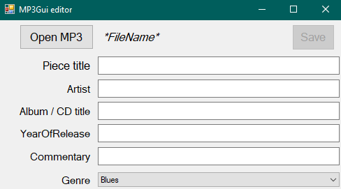
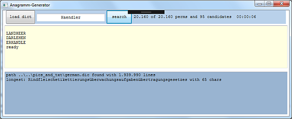

# C# Practice
The repository includes practice exercises in C# with solutions to various problems.
The tasks are divided into sections:
1) [Basics](#basics)
2) [Files](#files)
3) [LINQ](#linq)
4) [Asynchronous](#asynchronous)
5) [Windows forms](#windows-forms)
6) [WPF](#wpf)

**Targets**: `.NET Framework 4.8` and `.NET 6`.

Projects are logically divided into Solution Folders.

## 1. OOP
A set of tasks aimed at basic understanding of the .NET platform. 
Examples of working with classes, interfaces, exceptions and tests.

**Console applications only.**

[//]: # (__________________________________________________________)
### 1.1 Calculator
*.NETFramework v4.8*

#### Task:
1. Create a class that provides the 4 basic arithmetic operations
  each as a method.
    - Addition, subtraction, multiplication and division
2. Create a class for tests using **NUnit**
3. **\*Extra**: Create a generic class that supports operations on any type.
  
#### Technologies:
- [Static class](https://learn.microsoft.com/en-us/dotnet/csharp/programming-guide/classes-and-structs/static-classes-and-static-class-members) and methods
- **NUnit**
- Generics

#### The functionality is divided into 2 projects:
- Application logic - [Calculator](Sources/OOP/Calculator)
- Tests - [CalculatorTests](Sources/OOP/CalculatorTests)

[//]: # (__________________________________________________________)
### 1.2 Gear Factory

#### Technologies:
- Console application
  - Input output from the console
- Classes

#### Task:
Create a gear inventory application.

The program will greet the user with 4 functions.
1) Fill in gear weight information
2) Output the completed information
3) Output the average weight of all gears
4) Exit program

#### The implementation is in the next project:
- Application logic - [GearFactory](Sources/OOP/GearFactory)

[//]: # (__________________________________________________________)
### 1.3 Vehicles

#### Technologies:
- Console application
- Classes and Interfaces

#### Task:
Create an inheritance hierarchy for different vehicles.

Each traffic participant has a `MovesBy` method, which outputs a line about 
the characteristics of the movement. 
- This can be both general characteristics and information that only a 
particular traffic participant possesses.

Map the following entities into classes and create a meaningful inheritance 
hierarchy:
1) **Vehicle**
   - number of wheels
   - number of passengers it can carry
2) **Truck**
   - max weight it can carry
3) **Car**
   - manufacturer (create a Enum for this, allowing you to select different manufacturers)
   - number of doors
   - manual or automatic transmission
4) **Bicycle**
   - type - cargo, racing, recumbent, folding... (create another Enum for this)
   - Indicates whether the bike is lit or not.
5) **Pedestrian**
   - has an age and sex.

Create a list of traffic participant in your main method and call the method `MovesBy()` 
for each of them.

#### The implementation is in the next project:
- Application logic - [Vehicles](Sources/OOP/Vehicles)

[//]: # (__________________________________________________________)
### 1.4 Validation of login forms
**NOT IMPLEMENTED**
#### Technologies:
- Console application
  - Input output from the console
- Regular expressions
- Array examining

#### Task:
Make two versions of the validation function for:
- email,
- phone number,
- zip code

One variant should use regular expressions, the other - explore a 
string as an array.

[//]: # (__________________________________________________________)
### 1.5 Calculation task generator with timing
**NOT IMPLEMENTED**
#### Technologies:
- Loops
- Random
- DateTime
- TimeSpan

#### Task:
Create a program that presents 10 arithmetic tasks to the user.

Arithmetic task consist of:
- two randomly chosen numbers between 1 and 10 
- randomly chosen operator ( + , - , \/, \*).

User is  prompted to enter a result.
If the result is incorrect, the following text is displayed.
"The result is incorrect!"
This continues until the user solves the task correctly.
After the 10 tasks have been solved, the time required is to be output on the console.

## 2. Files

[//]: # (__________________________________________________________)
### 2.1 File system information
#### Technologies:
- Console application
- `DriveInfo` & `DirectoryInfo` & `FileInfo`

#### Task:
Write a program with 2 functions:
1) Output all file extensions inside a folder. The path to the folder must be passed to the function
2) Output information about all storage devices on your computer in the following format: name, size, available space

#### The implementation is in the next project:
- Application logic - [FsInformation](Sources/Files/FsInformation)

[//]: # (__________________________________________________________)
### 2.2 Simple name generator
**NOT IMPLEMENTED**
#### Technologies:
- Console application
- Reading files
    - `File.ReadAllLines()`
    - `StreamReader ReadLine()`

#### Task:
Write a program that loads two text files (e.g. Firstname.txt, Lastname.txt)
line by line into an array. Then output a random combination of first name and
last name.

## 3. LINQ

[//]: # (__________________________________________________________)
### 3.1 Filtering by first and last letter
**NOT IMPLEMENTED**

#### Technologies:
- Console application
- LINQ
    - `.StartsWith()`
    - `.EndsWith()`
- Listen

#### Task:
Write a program that filters words from a list by their initial and final letters.
The list of words can be taken from [here](https://gist.github.com/MarvinJWendt/2f4f4154b8ae218600eb091a5706b5f4#file-wordlist-german-txt/).

[//]: # (__________________________________________________________)
### 3.2 Words in a certain position
**NOT IMPLEMENTED**

#### Technologies:
- Console application
- LINQ
    - `.Take())`
- - Listen

#### Task:
Write a program that outputs objects from the collection based on their position.
Use the dictionary from the previous assignment.

**Example usage:**
- Output all words at positions 10-20, 110-120, 210-220, and 310-320

## 4. Asynchronous

[//]: # (__________________________________________________________)
### 4.1 Parallel file downloads
#### Technologies:
- Console application
- `async` & `await` 
- `WebClient` & `Uri`

#### Task:
Program to track the status of downloads. Several URI paths are passed, which can be used 
to load files over HTTP. The files are installed in individual threads. 
For this, a main thread will track progress and draw status bar in the console:

7 files to be loaded, 3 already loaded: `[+++----]`

#### The implementation is in the next project:
- Application logic - [FileDownload](Sources/Asynchronous/FileDownload)

[//]: # (__________________________________________________________)
### 4.2 Grep
#### Technologies:
- Console application
- `async` & `await`
- `FileInfo` & `DirectoryInfo`

#### Task:
**"grep"** program, which does almost the same thing `grep(1)` does under Linux:

It takes a byte string or normal string, as well as a path to a folder, and searches 
for the same strings in files located in that folder and subfolders. 
- For each folder a "folder" thread is created, and for each file a "file" thread.
- Folder thread waits for the file threads and folder threads it created.
- Program starts with only one thread - with one folder thread for the folders 
passed in parameters.

#### The implementation is in the next project:
- Application logic - [Grep](Grep)

## 5. Windows forms

[//]: # (__________________________________________________________)
### 5.1 Picture Viewer
[Microsoft Tutorial](https://learn.microsoft.com/en-gb/visualstudio/get-started/csharp/tutorial-windows-forms-picture-viewer-layout?view=vs-2022)

#### The implementation is in the next project:
- GUI - [PictureViewer](PictureViewer)

[//]: # (__________________________________________________________)
### 5.2 Timed math quiz
[Microsoft Tutorial](https://learn.microsoft.com/en-gb/visualstudio/get-started/csharp/tutorial-windows-forms-math-quiz-create-project-add-controls?view=vs-2022)

#### The implementation is in the next project:
- GUI - [MathQuiz](MathQuiz)

[//]: # (__________________________________________________________)
### 5.3 Matching game
[Microsoft Tutorial](https://learn.microsoft.com/en-gb/visualstudio/get-started/csharp/tutorial-windows-forms-create-match-game?view=vs-2022)

#### Task:
Matching game, where the player matches pairs of hidden icons.

#### The implementation is in the next project:
- GUI - [MatchingGame](MatchingGame)

[//]: # (__________________________________________________________)
### 5.4 Read and edit information from MP3 files

#### Technologies:
- Windows Forms
  - TextBox, Label, ComboBox, Button
- File Streams
- Extension methods
- Exceptions
- NUnit

#### Task:
An application where you can select an mp3 file, process its information, and save it.

This information ("ID3 tags") are located as strings in the **last 128 bytes** of the file.
- Tag (3)
- Piece title (30)
- Artist (30)
- Album / CD title (30)
- Year of release (4)
- Commentary (30)
- Genre (1)

First you need to check if the file is really a valid MP3 file. 
For this, Tag must be equal to "TAG".
When the file is read, the text fields display information, they can be edited and saved with another button.

#### The functionality is divided into 3 projects:
- Application logic - [MP3FileStream](MP3FileStream)
- Tests - [MP3FileStreamTests](MP3FileStreamTests)
- GUI - [MP3Gui](MP3Gui)

[//]: # (__________________________________________________________)
### 5.5 Anagram generator

#### Technologies:
- Windows Forms
- Reading a file
- Listing data structures

#### Task:
Write a program that takes a base word and gives a list of anagrams, working on the basis
of German words.

A [list](https://gist.github.com/MarvinJWendt/2f4f4154b8ae218600eb091a5706b5f4#file-wordlist-german-txt) 
of all meaningful German words is needed.

#### The functionality is divided into 2 projects:
- Application logic - [Anagram](Anagram)
- Tests - [AnagramTests](AnagramTests)

## 6. WPF

[//]: # (__________________________________________________________)
### 6.1 Customer App

[//]: # (__________________________________________________________)
### 6.2 "Chat application" with the help of writing files

#### Technologies:
- WPF
- Reading and writing files

#### Task:
Write an application that writes a text file to a folder and can read its contents.
Multiple instances of the application can be launched on different computers,
creating a quasi-chat

**Step 1:**
- Create the application based on a console application.

**Step 2:**
- Transfer the application to Windows Forms
    - Using text fields
    - Reacting to button click
    - Ribbon?

**Step 3:**
- Create an encryption of the chat using the encryption method: **One Time Pad**
- Add to the chat application the functionality to generate a file with a freely definable number of keys
    - each of these keys is 250 characters long and can be used to encrypt and decrypt a message up to 250 characters long
    - When clicking the button to create the key file, a .txt file containing the specified number of keys is created in the file system
- Continue to add the functionality to read a key file for your chat or set the path to it
- Every time a message is written, the top unused key is read from the file and used to encrypt the entered message
- When a message is received or read from the file the same key from the file is used for decryption