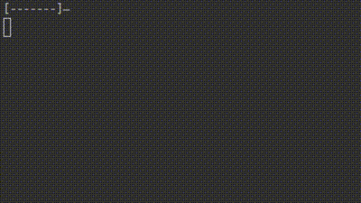
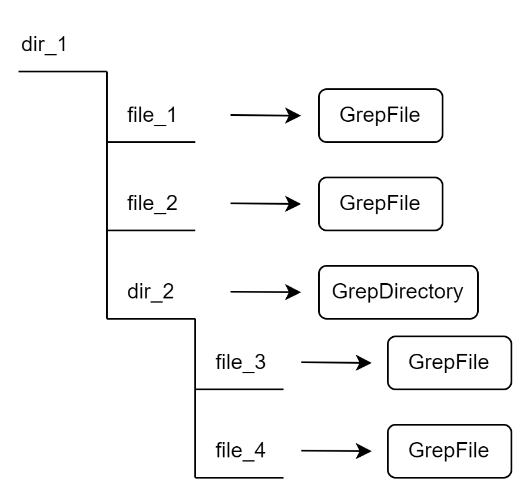

# Asynchronous

### 1. Console status bar

#### Task:
Program to track the status of downloads. 

Several URI paths are passed, which can be used
to load files over HTTP. The files are installed in individual threads.
For this, a main thread will track progress and draw status bar in the console:

7 files to be loaded, 3 already loaded: `[+++----]`

#### Technologies:
- Console application
- `async` & `await`
- `WebClient` & `Uri`

#### The implementation is in the next project:
- Application logic - [FileDownload](FileDownload)

[//]: # (__________________________________________________________)
### 2. Grep

#### Task:
**"grep"** program, which does almost the same thing `grep(1)` does under Linux:

It takes a byte string or normal string, as well as a path to a folder, and searches
for the same strings in files located in that folder and subfolders.
- For each folder a "folder" thread is created, and for each file a "file" thread.
- Folder thread waits for the file threads and folder threads it created.
- Program starts with only one thread - with one folder thread for the folders
  passed in parameters.

#### Technologies:
- Console application
- `async` & `await`
- `FileInfo` & `DirectoryInfo`

#### The implementation is in the next project:
- Application logic - [Grep](Grep)