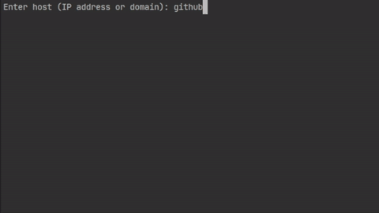
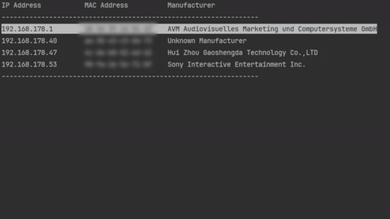

# Networking

[//]: # (__________________________________________________________)
## 1. Ping Utility
A simple command-line application that performs continuous ping tests to a specified host, 
providing real-time feedback and logging results for later analysis.

### Features:
- Continuous Pinging: Sends ping requests at a specified interval.
- Customizable **Timeout**: Set a timeout for each ping request.
- **Error Handling**: Graceful handling of ping failures and exceptions.
- **Logging**: Records ping results to a log file for future reference.
- **Statistics**: Displays success rates, minimum, maximum, and average roundtrip times.

### Usage:
1. Go to the project folder.<br/>
2. Run the application:
```bash
dotnet run <host> <timeout> <logFilePath>
```
- `host`: IP address or domain to ping.
- `timeout`: Timeout in milliseconds for each ping request (optional, default: 1000ms).
- `logFilePath`: Path to the log file (optional, default: ping_log.txt).

### Example:
Execution without command line arguments.


<br><br>


[//]: # (__________________________________________________________)
## 2. Port Scanner
Utility that scans devices in **local network** for open, closed, or error-prone 
**ports** within a given range.

The program displays results in a clear, **tabular format**, 
allowing users to quickly identify active services on networked devices. 
Additionally, it includes an option to **identify devices** by MAC address, 
displaying manufacturer details to enhance device recognition.

### Features:
- **Device Selection**: Scans local network for devices, displaying IP, MAC, and manufacturer.
- **Manufacturer Lookup**: Queries MAC address details to identify device manufacturers.
- **Port Scanning**: Tests for open and closed ports over a specified range.
- **Progress Visualization**: Displays a progress bar during the scan for real-time feedback.
- **Detailed Report**: Outputs port status in ranges for easier readability.

### Usage:
1. Run the program, and select a device from your local network.
2. Specify the start and end ports to scan.
<p>The program will display real-time progress and present a summary report.</p>

### Example:


#### Dependencies:
- **ShellProgressBar**: NuGet package for enhanced console progress bar.

### Possible Improvements:
- Export results to JSON/CSV.
- Implement retry on failed requests.
- Enhance MAC address lookup for additional device information.

___

# 🌱 Future Projects

## 3. Simple Chat Application
Create a client-server chat application using sockets. This can be a console 
application where multiple clients can connect and chat with each other.

## 4. File Transfer Application
Develop an application that allows users to send files over a network.
Implement both client and server sides to handle file transfers.

## 5. HTTP Web Server
Create a simple HTTP server that can serve static files and handle basic requests.