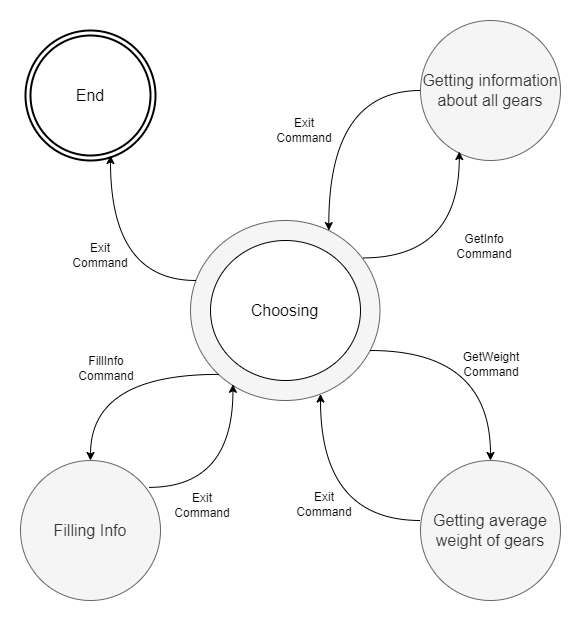

# OOP

[//]: # (__________________________________________________________)
## 1. Calculator
*.NETFramework v4.8*

#### Task:
1. Create a class that provides the 4 basic arithmetic operations
   each as a method.
    - Addition, subtraction, multiplication and division
2. Create a class for tests using **NUnit**
3. **\*Extra**: Create a generic class that supports operations on any type.

#### Technologies:
- [Static class](https://learn.microsoft.com/en-us/dotnet/csharp/programming-guide/classes-and-structs/static-classes-and-static-class-members) and methods
- **NUnit**
- Generics

#### The functionality is divided into 2 projects:
- Application logic - [Calculator](Calculator)
- Tests - [CalculatorTests](CalculatorTests)
  

[//]: # (__________________________________________________________)
## 2. Gear Factory
*.NETFramework v4.8*

#### Task:
Create a gear inventory application.

The program will greet the user with 4 functions.
1) Fill in gear weight information
2) Output the completed information
3) Output the average weight of all gears
4) Exit program

#### Technologies:
- Console application
    - Input output from the console
- Classes

#### The implementation is in the next project:
- Application logic - [GearFactory](GearFactory)
    

[//]: # (__________________________________________________________)
## 3. Vehicles
*.NETFramework v4.8*

#### Task:
Create an inheritance hierarchy for different vehicles.

Each traffic participant has a `MovesBy` method, which outputs a line about
the characteristics of the movement.
- This can be both general characteristics and information that only a
  particular traffic participant possesses.

Map the following entities into classes and create a meaningful inheritance
hierarchy:
1) **Vehicle**
    - number of wheels
    - number of passengers it can carry
2) **Truck**
    - max weight it can carry
3) **Car**
    - manufacturer (create an Enum for this, allowing you to select different manufacturers)
    - number of doors
    - manual or automatic transmission
4) **Bicycle**
    - type - cargo, racing, recumbent, folding... (create another Enum for this)
    - Indicates whether the bike is lit or not.
5) **Pedestrian**
    - has an age and sex.

Create a list of traffic participant in your main method and call the method `MovesBy()`
for each of them.

#### Technologies:
- Console application
- Classes and Interfaces

#### The implementation is in the next project:
- Application logic - [Vehicles](Vehicles)
    

___

# 🌱 Future Projects

[//]: # (__________________________________________________________)
## 4. Validation of login forms
*.NETFramework v4.8*

**NOT IMPLEMENTED**

#### Technologies:
- Console application
    - Input output from the console
- Regular expressions
- Array examining

#### Task:
Make two versions of the validation function for:
- email,
- phone number,
- zip code

One variant should use regular expressions, the other - explore a
string as an array.
  

[//]: # (__________________________________________________________)
## 5. Calculation task generator with timing
*.NETFramework v4.8*

**NOT IMPLEMENTED**

#### Task:
Create a program that presents 10 arithmetic tasks to the user.

Arithmetic task consist of:
- two randomly chosen numbers between 1 and 10
- randomly chosen operator ( + , - , \/, \*).

User is  prompted to enter a result.
If the result is incorrect, the following text is displayed.
"The result is incorrect!"
This continues until the user solves the task correctly.
After the 10 tasks have been solved, the time required is to be output on the console.

#### Technologies:
- Loops
- Random
- DateTime
- TimeSpan