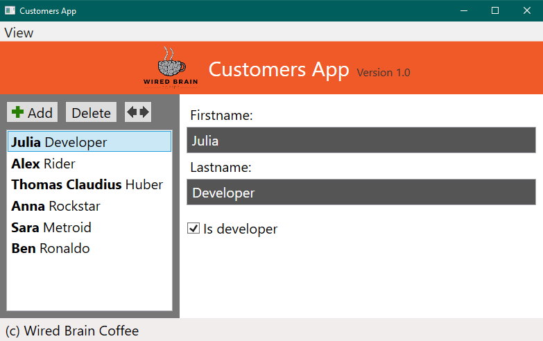

# WPF

[//]: # (__________________________________________________________)
### 6.1. Customer App

[//]: # (__________________________________________________________)
### 6.2. "Chat application" with the help of writing files

#### Task:
Write an application that writes a text file to a folder and can read its contents.
Multiple instances of the application can be launched on different computers,
creating a quasi-chat

**Step 1:**
- Create the application based on a console application.

**Step 2:**
- Transfer the application to Windows Forms
    - Using text fields
    - Reacting to button click
    - Ribbon?

**Step 3:**
- Create an encryption of the chat using the encryption method: **One Time Pad**
- Add to the chat application the functionality to generate a file with a freely definable number of keys
    - each of these keys is 250 characters long and can be used to encrypt and decrypt a message up to 250 characters long
    - When clicking the button to create the key file, a .txt file containing the specified number of keys is created in the file system
- Continue to add the functionality to read a key file for your chat or set the path to it
- Every time a message is written, the top unused key is read from the file and used to encrypt the entered message
- When a message is received or read from the file the same key from the file is used for decryption

#### Technologies:
- WPF
- Reading and writing files