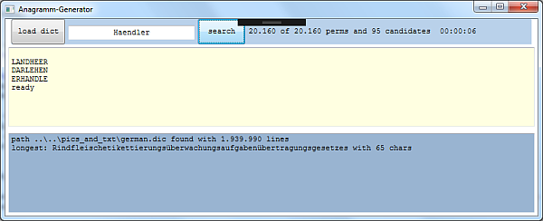

# Windows Forms
[//]: # (__________________________________________________________)
### 1. Picture Viewer
[Microsoft Tutorial](https://learn.microsoft.com/en-gb/visualstudio/get-started/csharp/tutorial-windows-forms-picture-viewer-layout?view=vs-2022)

#### The implementation is in the next project:
- GUI - [PictureViewer](PictureViewer)

[//]: # (__________________________________________________________)
### 2. Timed math quiz
[Microsoft Tutorial](https://learn.microsoft.com/en-gb/visualstudio/get-started/csharp/tutorial-windows-forms-math-quiz-create-project-add-controls?view=vs-2022)

#### The implementation is in the next project:
- GUI - [MathQuiz](MathQuiz)

[//]: # (__________________________________________________________)
### 3. Matching game
[Microsoft Tutorial](https://learn.microsoft.com/en-gb/visualstudio/get-started/csharp/tutorial-windows-forms-create-match-game?view=vs-2022)

#### Task:
Matching game, where the player matches pairs of hidden icons.

#### The implementation is in the next project:
- GUI - [MatchingGame](MatchingGame)

[//]: # (__________________________________________________________)
### 4. Read and edit information from MP3 files

#### Task:
An application where you can select a mp3 file, process its information, and save it.

This information ("ID3 tags") are located as strings in the **last 128 bytes** of the file.
- Tag (3)
- Piece title (30)
- Artist (30)
- Album / CD title (30)
- Year of release (4)
- Commentary (30)
- Genre (1)

First you need to check if the file is really a valid MP3 file.
For this, Tag must be equal to "TAG".
When the file is read, the text fields display information, they can be edited and saved with another button.

#### Technologies:
- Windows Forms
    - TextBox, Label, ComboBox, Button
- File Streams
- Extension methods
- Exceptions
- NUnit

#### The functionality is divided into 3 projects:
- Application logic - [MP3FileStream](MP3FileStream)
- Tests - [MP3FileStreamTests](MP3FileStreamTests)
- GUI - [MP3Gui](MP3Gui)

[//]: # (__________________________________________________________)
### 5. Anagram generator

#### Task:
Write a program that takes a base word and gives a list of anagrams, working on the basis
of German words.

A [list](https://gist.github.com/MarvinJWendt/2f4f4154b8ae218600eb091a5706b5f4#file-wordlist-german-txt)
of all meaningful German words is needed.

#### Technologies:
- Windows Forms
- Reading a file
- Listing data structures

#### The functionality is divided into 2 projects:
- Application logic - [Anagram](Anagram)
- Tests - [AnagramTests](AnagramTests)